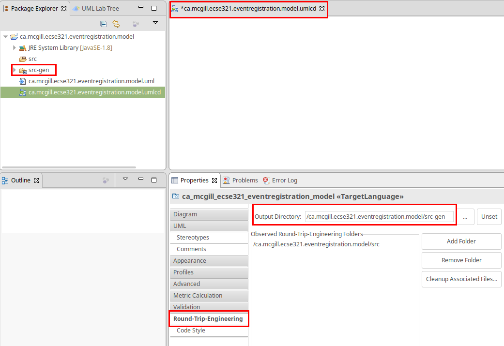
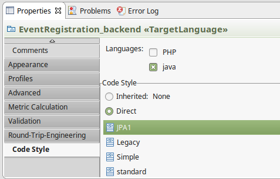
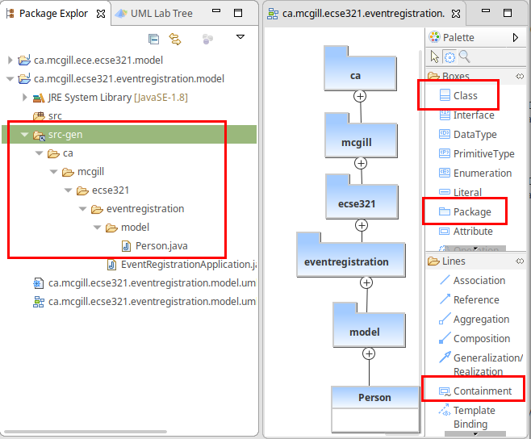
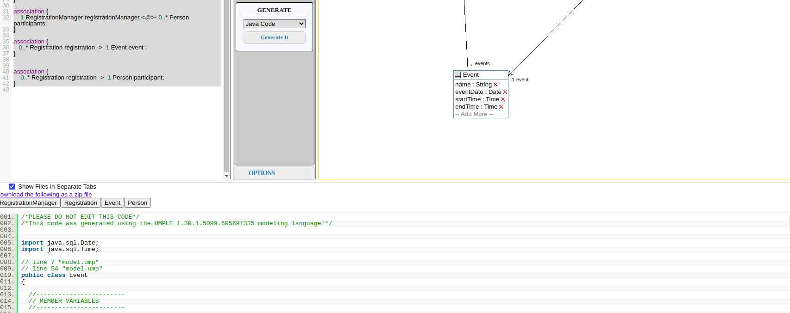

=== Domain modeling and code generation

==== Installing UML Lab

Go to link:https://www.uml-lab.com/en/download/[the download page of UML Lab] and install it on your machine. You can either register for the academic program or download UML Lab 30 days for free. UML Lab generates the JPA compliant code automatically from the domain model (class diagram). You can also use link:https://cruise.umple.org/umpleonline/[Umple] to generate POJO classes for your class diagram. In this case, you have to manually add the JPA annotations to the generated POJO classes.

[NOTE]
If you plan to use UML Lab then by the time of the tutorial, you may not have the license key ready for academic program as it takes some time. You should be able to work with a 30-day trial version in this case and activate your academic license later. You can follow steps 2.4.1 to 2.4.3.

[NOTE]
If you plan to use link:https://cruise.umple.org/umpleonline/[Umple] or some other tool for generating the Java classes from the UML class diagram then you have to follow the step 2.4.4. Please note in this approach you have to refine the code and add the JPA annotations manually.

==== UML Lab project setup

[NOTE]
Once you start UML Lab, there are some useful tutorials that help you learn about the features of the modeling tool. Furthermore, there is an introduction on how to use and configure UML Lab link:https://www.clear.rice.edu/comp310/Eclipse/UMLLab/[among the resources of Rice University].

. Create a new UML Lab Java project with the name `ca.mcgill.ecse321.eventregistration.model` with the default project settings.

. Within the project, create a linked folder (Select Project -> New Folder -> Click Advanced Button -> select "Link to alternate location (linked folder)" option) that points to the _src/main/java_ folder of your `Eventregistration-Backend` project. Name the folder as _src-gen_. It will be used as the target for generating model code. +
image:figs/link-folder.png[Linking folder,width=600]
+
[CAUTION]
Links to folders will not be versioned, so each team member needs to set this link individually after cloning the project.

. Open the _ca.mcgill.ecse321.eventregistration.model.umlcd_ diagram file by double clicking it. It is an empty diagram by default.

. Click on the empty diagram editor canvas and open the _properties view_ and configure code generation path. +

. In the same _Properties view_, apply the _Direct > JPA1_ code style. +

==== Domain modeling exercise: the Event Registration System

. Using the _Palette_ on the left hand side of the class diagram editor, create the following package structure and the `Person` class, and connect them with the _Containment_ line. Once you save the diagram, the code should be generated to the _src-gen_ folder (left part of the figure below). +

+
[NOTE]
If you disabled the automatic code generation on file save action, then you need to do _right click the diagram -> generate code_ manually.

. Study the generated `Person` class in the `ca/mcgill/ecse321/eventregistration/model` package (folder)!

. In the upcoming steps, we will use the `java.sql.Time` and `java.sql.Date` data types from the Java Runtime Library, so we need to add them to the model as datatypes. +
image:figs/umllab-datatype.png[Adding data types,width=600]

. Extend the diagram by adding more classes and association and composition relations as shown below. Pay extra attention to the navigability and multiplicity of the references. +
image:figs/classdiag-complete.png[Class Diagram With Classes,width=600]

. Select attributes to be primary keys (`Person`: id is `name`, `Event`: id is `name`, `Registration`: id is `id`) +
image:figs/umllab-primarykey.png[Selecting primary keys,width=600]
[NOTE]
Verify the generated code:remove any `@OneToOne` annotations from getters associated with `Date` and `Time` from the `Event` class.

. Create an extra `int` attribute for the `RegistrationManager` as well and set it as the ID (similarly to the other three classes). +
[CAUTION]
If you forget to supply an ID to *any of your entities*, Hibernate will throw an exception and you application will fail to start.

. Share the modeling project to git. You can use the command line git client or EGit. +
image:figs/umllab-share-project.png[width=600]

==== Adding JPA Annotations to POJO classes
. For example, if we use link:https://cruise.umple.org/umpleonline/[Umple] tool then we can use the below textual code (in left window in Umple) to generate the class digaram (in right window in Umple). You can also directly create the class diagram in the graphical window on right.

+
[source,umple]
----
class Person
{
  name;
}

class Event
{
  name;
  Date eventDate;
  Time startTime;
  Time endTime;
}

class Registration
{
  Integer id;
  }

class RegistrationManager
{
}

association {  
    1 RegistrationManager registrationManager <@>- 0..* Registration registrations;  
}

association {  
    1 RegistrationManager registrationManager <@>- 0..* Event events;  
}

association {  
    1 RegistrationManager registrationManager <@>- 0..* Person participants;  
}

association {  
   0..* Registration registration ->  1 Event event ;  
}

association { 
    0..* Registration registration ->  1 Person participant;
}
----

. Next, you can generate the Java code and see the generated code in different tabs as shown in the below figure. +

+
[NOTE]
The above example is just to illustrate how to generate Java classes from a class diagram. As mentioned earlier, the generated code from Umple tool is not JPA compliant. We have to refine it and add JPA annotations manually.

. The final code (directly from UML lab OR after refining the code obtained from Umple) which is JPA compliant is available here: link:https://github.com/McGill-ECSE321-Fall2020/ecse321-tutorial-notes/raw/master/resources/Computation.zip[Model Classes.zip]. For gaining insights into JPA complaint code, please compare link:https://github.com/McGill-ECSE321-Fall2020/ecse321-tutorial-notes/raw/master/resources/Computation.zip[Model Classes.zip] with the code generated from Umple to see the differences and also where to add JPA annotations.

